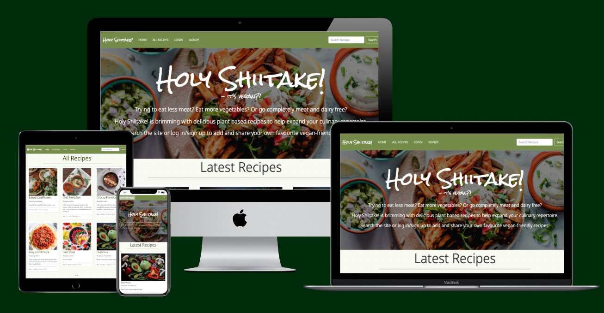

# Holy Shiitake!!! 

## Introduction

Holy Shiitake is a website dedicated to sharing, creating and interacting with vegan recipes.  Whether you are vegan, a vegetarian looking to reduce your dairy intake, or are looking for something different to add to your recipe repertoire, Holy Shiitake is the place to be!

Browse through the recipes already added to the site for a bit of inspiration, or if you are a seasoned vegan, share your recipes with others to help get them on the 'band-wagon'!

Users have the ability to search through recipes already added to the site and registered users can create, update and delete their own recipes as well as comment on and like other users recipes.  The site provides role-based permissions and the SuperUser is able to approve, edit and delete recipes from the website itself and also via the admin panel.

Holy Shiitake has been built using the Django framework in Python, HTML and CSS, and provides user authentication and full CRUD functionality for recipes.

[Visit the live site on Heroku](https://holy-shiitake.herokuapp.com/)

## UX - User Experience Design

## The Strategy Plane

### Concept

This project has been developed as part of the [Code Institute's](https://codeinstitute.net/) Diploma in Full-Stack Software Development. The aim is to create a full-stack that will demonstrate the skills I have learnt in HTML, CSS and Javascript

The main aim of the website is to provide a space for those looking for vegan/plant-based meal options to search for and create their own recipes.  When logged in, users will be able comment on recipes, like recipes and have full CRUD functionality of their own recipes.  A SuperUser will be able to approve, edit and delete user recipes to allow them to manage the content of the site and ensure no meat/dairy recipes are submitted.

The sites target audience is:
* Vegans and vegetarians looking for inspiration for plant-based, vegan-friendly.
* People who are looking to reduce their meat/dairy intake.
* People who are looking to increase their recipe repertoire to include meat and dairy free dishes.

### Site Goals

* To provide user with a space to search for strictly plant-based, vegan-friendly recipes
* To provide users with a visually pleasing website that is intuitive to use and easy to navigate
* To provide a website where the purpose is immediately clear
* To provide role-based permissions that allows user to create, edit and delete their own recipes and site admin to approve, edit and delete recipes.

### User Stories

<strong>As a General Site User:</strong>

* I can search through the recipes using a keyword so I can find a specific recipe containing a main ingredient I would like to use.
* I can view a paginated list of recipes so I can select a recipe to try.
* I can view the comments on recipes so I can see tips and suggestions.
* I can click on a recipe to see the list of ingredients and steps necessary to make the meal.
* I can navigate easily around the site to find what I am looking for.

<strong>As a Registered Site User:</strong>

* I can register for an account to enable me to utilise the functionality available for registered users.
* I can create and share my own recipes for others users to view.
* I can edit my recipes so that I can keep them up to date.
* I can delete my recipes so that I can remove unwanted recipes.
* I can comment on other user’s recipes to interact with the content.
* I can like recipes so I can interact with the content.

<strong>As a SuperUser:</strong>

* I can create draft recipe posts so that come back and finished them later.
* I can approve user-created recipes so that I can manage the content of the site and filter out inappropriate recipes
* I can edit user-created recipes so that they follow a consistent format and style for better user experience
* I can delete user-created recipes so that I can filter out inappropriate content.

## The Scope Plane

### Features planned

* Intuitive and simple design
* Visually appealing site 
* Intuitive navigation across all pages
* Role-based navigation for different users 
* Recipes - Registered users can create, read, update and delete their recipes
* Search - All users can use the search bar to search recipes by keyword
* Comments & Likes - Registered Users can comment and like recipes
* User Sign Up and Log in/Out
* Custom 404 & 500 error pages for good user experience

## The Structure Plane

## Design

### Color Scheme

I wanted to kee the color scheme simple so opted for a combination of plain white text set against a green background for the nav bar and social links in the footer and dark green text set against a white background for the recipe cards/recipe views.  Buttons were styled using either a green background with white text or a deep red with white text and hover effects transitioning the colors to slightly lighter shades when hovered over.

All colours used were pulled from the background image using [imagecolorpicker.com](imagecolorpicker.com).

I used [EightShapes Contrast Grid](https://contrast-grid.eightshapes.com) to ensure that all text and background combinations used met the required contrast ratios in compliance with [WCAG 2.0 minimum contrast](https://www.w3.org/TR/UNDERSTANDING-WCAG20/visual-audio-contrast-contrast.html).

### Typography

Two fonts are used throughout the website, both sourced from [Google Fonts](https://fonts.google.com/).  'Rock Salt' was used for the website name and slogan and Recipe Headings on the recipe detail view and 'Noto Sans Display' was used for all other text - upper case for the Navigation Bar for differentiation and standard case for the remainder of the website.  These two fonts pair well together, the handwritten style of 'Rock Salt' gives a personal feel to the branding and 'Noto Sans Display' is a simple and readable.  

### Imagery

For the landing page I used an image sourced from [Unsplash](unsplash.com) of a platter of vegan food from the tope view.  It is brightly coloured and gives the impression of tasty and exciting food.  I gave this image a grey overlay to tone down the colours and allow the title and text on top to stand out. 

I also sourced an image from [Pexels](pexels.com) to use as a placeholder image if the user does not have their own image to upload when creating a recipe.  This image was a selection of chopped vegetables and gives the impression of fresh, healthy produce.

All other images that will be uploaded to the site will be chosen by the user, however as Admin need to approve all recipes before they are made public on the site, Admin can change the image as they see fit if the image uploaded is not in keeping with the theme of the website or is inappropriate. 

## Wireframes 

## Database Schema

Two custom models were created for the website, Recipes and Comments and Django AllAuth was utilised for user authentication.  The below ERD was created using [DrawSQL](https://drawsql.app/home) although limitations of the app meant that textarea and Cloudinary fields were not available to use.

## Features

### Navigation Bar

There are three role-based versions of the navigation bar depending on the user:

* Navbar 1 - General users

This navbar gives the users the option to visit the homepage, view all recipes, log in or sign up.  There is also a search bar to the left hand side of the screen where users can search for recipes by keyword.  All users have access to the Home Page, All Recipes and the Search Functionality.

* Navbar 2 - Registered Users

This version of the navbar includes links to the Add Recipe page, My Recipes page and the Logout page.

* Navbar 3 - Super User

The final version of the navbar adds a further link to enable the super user to approve, edit and delete recipes uploaded by registered users of the site. 

### Footer

The footer is kept simple and clean incorporating social media links to encourage users to visit other social media sites related to the main web site (currently these just link to the generic social media sites) and a sentence to explain the site was created for educational purposes only.  All external links open in new tabs.

### Add more features here...

* Home page - This has a hero-image, title and slogan, brief description of the website and a call to action - Sign Up or Log In if not already logged in or Add Recipe if logged in.  Underneath the hero image, the latest six recipes will be displayed as recipe cards. 
* All Recipes - Paginated list of recipe cards ordered alphabetically.
* Add Recipe - Uses summernote to enable basic styling, including bold and underlined text, ordered and unordered lists and the option to expand each text box to full screen when editing. HTML form validation prevents the form being submitted unless all text fields are completed and error handling has been added to the upload button so that only images can be uploaded.  A placeholder image will be used for the recipe if the user does not have an image available to upload to the site. 
* My Recipes - Users are able to see a paginated list of the recipes they have added in with the most recently added recipes showing at the beginning of the list.  Buttons are included on the recipe cards here so the user can edit or delete the recipes as they see fit.  Pressing the delete button here take the user to a confirmation page to ensure they really want to delete the recipe before proceeding to prevent recipes from being accidentally deleted.
* Log in / Sign up / Log out - Django AllAuth has been utilised to allow users to securely log into the the website and gain access to functionality only available to registered users.
* Recipe Search - Users are able to search for recipes using a keyword.   The Recipe database will be searched against the Title, Description and Ingredients for each recipe.
* Recipe Cards - All recipes appear on the site as recipe cards, and when clicked into will link to a recipe detail page.  The Recipe cards summarise the recipe with the Recipe Name, Recipe Image, Author, Date Added, Number of Likes and a brief description of the recipe.
* Recipe Detail - When a recipe card is clicked this opens the recipe detail page which shows all of the information included on the recipe card and additionally the ingredients, method, comments and a comments box which can be used if the user is logged in.

### Future Features

* Better functionality and use of Django AllAuth.  I would like to implement more features of AllAuth in the future, including the ability to change the password or reset the password if forgotten.  I would also like to implement email verification and confirmation.

* I would also like to add the ability for the super user to approve comments through the website rather than just the admin panel.  Unfortunately, this was out of scope for this sprint. 

## Testing

### Bugs

When adding functionality to allow users to add comments to recipes, the user was able to post one comment, however if they were to comment on another post an error would display saying the user already existed.  Through debugging I noticed that when setting up the comments model, I had used unique=True in the name field.  This meant that the user could only ever comment on one recipe.  To fix this, I simply removed unique=True and migrated the changes to the database.  This fixed the error and users can now comment multiple times on multiple recipes.  

## Technologies 

### Languages

### Libraries/Frameworks

## Deployment

## Credits

Image by <a href="https://pixabay.com/users/pasja1000-6355831/?utm_source=link-attribution&amp;utm_medium=referral&amp;utm_campaign=image&amp;utm_content=4581877">pasja1000</a> from <a href="https://pixabay.com/?utm_source=link-attribution&amp;utm_medium=referral&amp;utm_campaign=image&amp;utm_content=4581877">Pixabay</a>

image by Photo by Trang Doan: https://www.pexels.com/photo/top-view-photo-of-food-dessert-1099680/