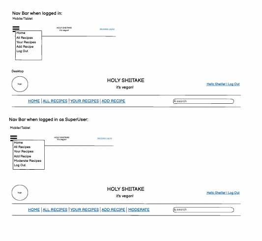

<h1 align=center>Holy Shiitake!!!</h1> 

<h2 align=center>Introduction</h2> 

Holy Shiitake is a website dedicated to sharing, creating and interacting with vegan recipes.  Whether you are vegan, a vegetarian looking to reduce your dairy intake, or are looking for something different to add to your recipe repertoire, Holy Shiitake is the place to be!   Browse through the recipes already added to the site for a bit of inspiration, or if you are a seasoned vegan, share your recipes with others to help get them on the 'band-wagon'!   Users have the ability to search through recipes already added to the site and registered users can create, update and delete their own recipes as well as comment on and like other users recipes.  The site provides role-based permissions and the SuperUser is able to approve, edit and delete recipes from the website itself and also via the admin panel.  Holy Shiitake has been built using the Django framework in Python, HTML and CSS, and provides user authentication and full CRUD functionality for recipes.

[Visit the live site on Heroku](https://holy-shiitake.herokuapp.com/)

 

## UX - User Experience Design

## The Strategy Plane

### Concept

This project has been developed as part of the [Code Institute's](https://codeinstitute.net/) Diploma in Full-Stack Software Development. The aim is to create a full-stack that will demonstrate the skills I have learnt in HTML, CSS and Javascript

The main aim of the website is to provide a space for those looking for vegan/plant-based meal options to search for and create their own recipes.  When logged in, users will be able comment on recipes, like recipes and have full CRUD functionality of their own recipes.  A SuperUser will be able to approve, edit and delete user recipes to allow them to manage the content of the site and ensure no meat/dairy recipes are submitted.

The sites target audience is:
* Vegans and vegetarians looking for inspiration for plant-based, vegan-friendly.
* People who are looking to reduce their meat/dairy intake.
* People who are looking to increase their recipe repertoire to include meat and dairy free dishes.

### User Stories

<strong>As a General Site User:</strong>

* I can search through the recipes using a keyword so I can find a specific recipe containing a main ingredient I would like to use.
* I can view a paginated list of recipes so I can select a recipe to try.
* I can view the comments on recipes so I can see tips and suggestions.
* I can click on a recipe to see the list of ingredients and steps necessary to make the meal.
* I can navigate easily around the site to find what I am looking for.

<strong>As a Registered Site User:</strong>

* I can register for an account to enable me to utilise the functionality available for registered users.
* I can create and share my own recipes for others users to view.
* I can edit my recipes so that I can keep them up to date.
* I can delete my recipes so that I can remove unwanted recipes.
* I can comment on other user’s recipes to interact with the content.
* I can like recipes so I can interact with the content.

<strong>As a SuperUser:</strong>

* I can create draft recipe posts so that come back and finished them later.
* I can approve user-created recipes so that I can manage the content of the site and filter out inappropriate recipes
* I can edit user-created recipes so that they follow a consistent format and style for better user experience
* I can delete user-created recipes so that I can filter out inappropriate content.

<strong>Agile Methodology</strong>

All functionality and development of this project were managed using GitHub Projects Kanban Board which can be found here:

[Holy Shiitake Recipe Sharing - USER STORIES](https://github.com/shellieD/holy-shiitake/projects/2)

## The Scope Plane

### Site Goals

* To provide user with a space to search for strictly plant-based, vegan-friendly recipes
* To provide users with a visually pleasing website that is intuitive to use and easy to navigate
* To provide a website where the purpose is immediately clear
* To provide role-based permissions that allows user to create, edit and delete their own recipes and site admin to approve, edit and delete recipes.

### Features planned

* Intuitive and simple design
* Visually appealing site 
* Intuitive navigation across all pages
* Role-based navigation for different users 
* Recipes - Registered users can create, read, update and delete their recipes
* Search - All users can use the search bar to search recipes by keyword
* Comments & Likes - Registered Users can comment and like recipes
* User Sign Up and Log in/Out
* Custom 404 & 500 error pages for good user experience

## The Structure Plane

## Functional Scope

### Flowchart

## Database Schema

Two custom models were created for the website, Recipes and Comments and Django AllAuth was utilised for user authentication.  The below ERD was created using [DrawSQL](https://drawsql.app/home) although limitations of the app meant that textarea and Cloudinary fields were not available to use.

## The Skeleton Plane

## Wireframes 

I used [Balsamiq](https://balsamiq.cloud/) to create low fidelity wireframes which helped me to stay on track during the development process.

Some modifications were made to the initial design during the development process based on user feedback and continuous testing.

Home Page Wireframes for Mobile, Tablet and Desktop

 

 

Alternative Navbar Wireframes for Mobile, Tablet and Desktop

 

 

All Recipes Page Wireframes for Mobile, Tablet and Desktop

 

 

Recipe Details Wireframes for Mobile, Tablet and Desktop

 

 

Add Recipe Wireframes for Mobile, Tablet and Desktop

 

    

 

## The Surface Plane

## Design

### Color Scheme

I wanted to kee the color scheme simple so opted for a combination of plain white text set against a green background for the nav bar and social links in the footer and dark green text set against a white background for the recipe cards/recipe views.  Buttons were styled using either a green background with white text or a deep red with white text and hover effects transitioning the colors to slightly lighter shades when hovered over.

All colours used were pulled from the background image using [imagecolorpicker.com](imagecolorpicker.com).

I used [EightShapes Contrast Grid](https://contrast-grid.eightshapes.com) to ensure that all text and background combinations used met the required contrast ratios in compliance with [WCAG 2.0 minimum contrast](https://www.w3.org/TR/UNDERSTANDING-WCAG20/visual-audio-contrast-contrast.html).

### Typography

Two fonts are used throughout the website, both sourced from [Google Fonts](https://fonts.google.com/).  'Rock Salt' was used for the website name and slogan and Recipe Headings on the recipe detail view and 'Noto Sans Display' was used for all other text - upper case for the Navigation Bar for differentiation and standard case for the remainder of the website.  These two fonts pair well together, the handwritten style of 'Rock Salt' gives a personal feel to the branding and 'Noto Sans Display' is a simple and readable.  

### Imagery

For the landing page I used an image sourced from [Unsplash](unsplash.com) of a platter of vegan food from the tope view.  It is brightly coloured and gives the impression of tasty and exciting food.  I gave this image a grey overlay to tone down the colours and allow the title and text on top to stand out. 

I also sourced an image from [Pexels](pexels.com) to use as a placeholder image if the user does not have their own image to upload when creating a recipe.  This image was a selection of chopped vegetables and gives the impression of fresh, healthy produce.

All other images that will be uploaded to the site will be chosen by the user, however as Admin need to approve all recipes before they are made public on the site, Admin can change the image as they see fit if the image uploaded is not in keeping with the theme of the website or is inappropriate. 

## Features

### Navigation Bar

There are three role-based versions of the navigation bar depending on the user:

* Navbar 1 - General users

This navbar gives the users the option to visit the homepage, view all recipes, log in or sign up.  There is also a search bar to the left hand side of the screen where users can search for recipes by keyword.  All users have access to the Home Page, All Recipes and the Search Functionality.

* Navbar 2 - Registered Users

This version of the navbar includes links to the Add Recipe page, My Recipes page and the Logout page.

* Navbar 3 - Super User

The final version of the navbar adds a further link to enable the super user to approve, edit and delete recipes uploaded by registered users of the site. 

### Footer

The footer is kept simple and clean incorporating social media links to encourage users to visit other social media sites related to the main web site (currently these just link to the generic social media sites) and a sentence to explain the site was created for educational purposes only.  All external links open in new tabs.

### Other Features

* Home page - This has a hero-image, title and slogan, brief description of the website and a call to action - Sign Up or Log In if not already logged in or Add Recipe if logged in.  Underneath the hero image, the latest six recipes will be displayed as recipe cards. 
* All Recipes - Paginated list of recipe cards ordered alphabetically.
* Add Recipe - Uses summernote to enable basic styling, including bold and underlined text, ordered and unordered lists and the option to expand each text box to full screen when editing. HTML form validation prevents the form being submitted unless all text fields are completed and error handling has been added to the upload button so that only images can be uploaded.  A placeholder image will be used for the recipe if the user does not have an image available to upload to the site. 
* My Recipes - Users are able to see a paginated list of the recipes they have added in with the most recently added recipes showing at the beginning of the list.  Buttons are included on the recipe cards here so the user can edit or delete the recipes as they see fit.  Pressing the delete button here take the user to a confirmation page to ensure they really want to delete the recipe before proceeding to prevent recipes from being accidentally deleted.
* Log in / Sign up / Log out - Django AllAuth has been utilised to allow users to securely log into the the website and gain access to functionality only available to registered users.
* Recipe Search - Users are able to search for recipes using a keyword.   The Recipe database will be searched against the Title, Description and Ingredients for each recipe.
* Recipe Cards - All recipes appear on the site as recipe cards, and when clicked into will link to a recipe detail page.  The Recipe cards summarise the recipe with the Recipe Name, Recipe Image, Author, Date Added, Number of Likes and a brief description of the recipe.
* Recipe Detail - When a recipe card is clicked this opens the recipe detail page which shows all of the information included on the recipe card and additionally the ingredients, method, comments and a comments box which can be used if the user is logged in.

### Future Features/Development

* Better functionality and use of Django AllAuth.  I would like to implement more features of AllAuth in the future, including the ability to change the password or reset the password if forgotten.  I would also like to implement email verification and confirmation.

* I would like to add the ability for the super user to approve comments through the website rather than just the admin panel.  Unfortunately, this was out of scope for this sprint. 

* I would like to include JavaScript so that the like button toggles on and off without the page being refreshed each time.  This was out of scope for this project.

## Testing

Testing has taken place continuously throughout the development of the website. Each view was tested regularly using print statements to ensure the expected outcome was achieved. When the outcome produced was not as expected, debugging was undertaken at that point. I have detailed below some of the bugs that have been resolved and some that remain (due to time constraints/knowledge gaps).

All testing and code validation information can be found in the separate [TESTING.md](TESTING.md) file

### Bugs

When adding functionality to allow users to add comments to recipes, the user was able to post one comment, however if they were to comment on another post an error would display saying the user already existed.  Through debugging I noticed that when setting up the comments model, I had used unique=True in the name field.  This meant that the user could only ever comment on one recipe.  To fix this, I simply removed unique=True and migrated the changes to the database.  This fixed the error and users can now comment multiple times on multiple recipes.  

When testing the add recipe form, it was noted that the ability to view the form as code was available.  This meant that anyone could insert javascript into the form.  This was tested for me by a fellow student who inserted javascript into the form and turned the background color of the whole page bright red.  Whilst this was not damaging to the website and was easily rectified by customising the summernote toolbar, it did reveal a potential vulnerability that could have had serious consequences if not picked up. 

When a user updates a recipe it is not sent to admin for approval, it updates and is published to the site.  This could mean that a user could edit their recipe with inappropriate content or with spelling errors/bad formatting and it would automatically be published, potentially jeopardising the integrity of the site.  This will be looked at and fixed in the next sprint.

Other than the above, no notable bugs have been found and the website functions as expected.

There are some more changes I would like to make to the styling in response to the accessibility report (see the [TESTING.md](TESTING.md) for more information) and to improve responsivness on all devices, but due to time constraints this wasn't possible before submission of this project.

## Technologies Used

* Python
    * The below modules were used for the development of this project
        * asgiref==3.5.0
        * cloudinary==1.29.0
        * dj-database-url==0.5.0
        * dj3-cloudinary-storage==0.0.6
        * Django==3.2.13
        * django-allauth==0.50.0
        * django-crispy-forms==1.14.0
        * django-summernote==0.8.20.0
        * gunicorn==20.1.0
        * oauthlib==3.2.0
        * psycopg2==2.9.3
        * PyJWT==2.3.0
        * python3-openid==3.2.0
        * pytz==2022.1
        * requests-oauthlib==1.3.1
        * sqlparse==0.4.2

 
### Libraries/Frameworks/Programs

* Django
    * Django was used as the main framework for the development of this full stack project.
    * Django AllAuth was utilised for user authentication. 

     

* Heroku PostgreSQL was used for the database
* Heroku - The project was deployed through Heroku.
* Bootstrap was used for 
* Jinga/Django Templating
* Balsamiq: Balsamiq was used to create the wireframes during the design process.
* Favicon Generator: Used to create favicon used on the website.
* Font Awesome: Font Awesome was used on all pages to add icons for aesthetic and UX purposes.
* Git: Git was used for version control by utilizing the Gitpod terminal to commit to Git and Push to GitHub.
* GitHub: GitHub is used to store the project's code after being pushed from Git.
* Google Fonts: Google fonts are used to add fonts for aesthetic and UX purposes.
* Multi Device Website Mockup Generator: Used to generate mockup image.
* DrawSQL.app was used to develop the database schema during development.
* Lucidcharts was used to created a flow chart.
* Tinypng
* JPG to WEBP | Cloudconvert

### Resources

* Code Institute's Codestar Django Blog was used in the beginning stages of the development of this project.  As I had never used Django before, I found the blog walkthrough to be very helpful in getting the initial app set up.   
* Django Documentation - I relied heavily on the Django official documentation during the build of this project.
* W3C Schools documentation for CSS
* Google
* Stack overflow
* Code Institute's Slack Community.

## Deployment

### Deployment through Heroku

1. Sign up / Log in to Heroku

2. From the main Heroku Dashboard page select 'New' and then 'Create New App'

3. Give the project a name and select a suitable region, then select create app. The name for the app must be unique. This will create the app within Heroku and bring you to the deploy tab. From the submenu at the top, navigate to the resources tab.

4. Add the database to the app, in the add-ons section search for 'Heroku Postgres', select the package that appears and add 'Heroku Postgres' as the database

5. Navigate to the setting tab, within the config vars section copy the DATABASE_URL to the clipboard for use in the Django configuration.

6. Within the django app repository create a new file called env.py - within this file import the os library and set the environment variable for the DATABASE_URL pasting in the address copied from Heroku. The line should appear as os.environ["DATABASE_URL"]= "Paste the link in here"

7. Add a secret key to the app using os.environ["SECRET_KEY"] = "your secret key goes here"
Add the secret key just created to the Heroku Config Vars as SECRET_KEY for the KEY value and the secret key value you created as the VALUE

8. In the settings.py file within the django app, import Path from pathlib, import os and import dj_database_url
insert the line if os.path.isfile("env.py"): import env
remove the insecure secret key that django has in the settings file by default and replace it with SECRET_KEY = os.environ.get('SECRET_KEY')
replace the databases section with DATABASES = { 'default': dj_database_url.parse(os.environ.get("DATABASE_URL"))} ensure the correct indentation for python is used.

9. In the terminal migrate the models over to the new database connection
Navigate in a browser to cloudinary, log in, or create an account and log in.

10. From the dashboard - copy the CLOUDINARY_URL to the clipboard
in the env.py file created earlier - add os.environ["CLOUDINARY_URL"] = "paste in the Url copied to the clipboard here"

11. In Heroku, add the CLOUDINARY_URL and value copied to the clipboard to the config vars
Also add the KEY - DISABLE_COLLECTSTATIC with the Value - 1 to the config vars
this key value pair must be removed prior to final deployment

12. Add the cloudinary libraries to the list of installed apps, the order they are inserted is important, 'cloudinary_storage' goes above 'django.contrib.staticfiles' and 'cloudinary' goes below it.

13. In the Settings.py file - add the STATIC files settings - the url, storage path, directory path, root path, media url and default file storage path.
Link the file to the templates directory in Heroku TEMPLATES_DIR = os.path.join(BASE_DIR, 'templates')

14. Change the templates directory to TEMPLATES_DIR - 'DIRS': [TEMPLATES_DIR]

15. Add Heroku to the ALLOWED_HOSTS list the format will be the app name given in Heroku when creating the app followed by .herokuapp.com

16. In your code editor, create three new top level folders, media, static, templates

17. Create a new file on the top level directory - Procfile

18. Within the Procfile add the code - web: guincorn PROJECT_NAME.wsgi

19. In the terminal, add the changed files, commit and push to GitHub

20. In Heroku, navigate to the deployment tab and deploy the branch manually - watch the build logs for any errors.

Heroku will now build the app for you. Once it has completed the build process you will see a 'Your App Was Successfully Deployed' message and a link to the app to visit the live site.

### Forking the Gihub Repository

1. By forking the GitHub Repository, you will be able to make a copy of the original repository on your own GitHub account, allowing you to view and/or make changes without affecting the original repository by using the following steps:

2. Log in to GitHub and locate the GitHub Repository At the top of the Repository (not top of page), just above the "Settings" button on the menu, locate the "Fork" button. You should now have a copy of the original repository in your GitHub account.

### Making a Local Clone

1. Log in to GitHub and locate the GitHub Repository Under the repository name.

2. Click "Clone or download". 

3. To clone the repository using HTTPS, under "Clone with HTTPS", copy the link. 

4. Open Git Bash.  

5. Change the current working directory to the location where you want the cloned directory to be made. 

6. Type git clone, and then paste the URL you copied in Step 3.

## Credits

* As this was my first Django project, I took a lot of inspiraiton from teh [Code Institute's]()

* The main image and the placeholder image were sourced from [Pixabay](https://pixabay.com/) and [Unsplash](https://unsplash.com/) respectively. 

* I found a great video on YouTube which helped me [create a custom 404 error page](https://www.youtube.com/watch?v=3SKjPppM_DU) by [Cryce Truly](https://www.youtube.com/c/CryceTruly)

* I also found a great tutorial on YouTube on [how to create a search bar](https://www.youtube.com/watch?v=AGtae4L5BbI).  This was created by [John Elder at Codemy.com]()

## Acknowledgments

* Huge thanks go to my fellow students who have been on hand to give me advice, support and encouragement through the development of this project.  [Matt Bodden](https://github.com/MattBCoding), [Chris Williams](https://github.com/Chr15w1986), [Dave Horrocks](https://github.com/DaveyJH) and [Ryan Sharp](https://github.com/Sharpryan20) - Thank you all so much for your help!  
* Massive thanks to my Mentor Brian O'Hare for his advice and encouragement.
* My family for being so patient whilst I spent many hours at my desk!