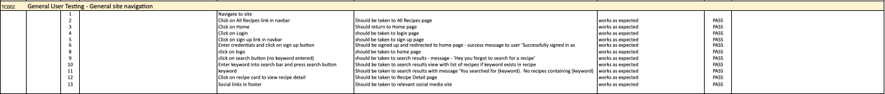

# Testing

Back to the [README.md](README.md)

## Testing Schedule

The full testing schedule report can be found [here](docs/testing/testing-schedule-holy-shiitake.numbers)

### Test Case 001

### Python Validation - PEP8

Python testing was conducted using the [PEP8 Online](http://pep8online.com/).  All python files were entered into the online checker and no errors were found in any of the custom code.  A few errors were raised in the settings file, however these were related to default django authorisation code and could not be changed to remove the errors.

Screenshots of teh PEP8 results can be found below:
* Holy Shiitake Folder
    * [asgi.py](docs/testing/PEP8-HS-asgi.png)
    * [settings.py](docs/testing/PEP8-HS-settings.png)
    * [urls.py](docs/testing/PEP8-HS-urls.png)
    * [views.py](docs/testing/PEP8-HS-views.png)
    * [wsgi.py](docs/testing/PEP8-HS-wsgi.png)
* Recipes Folder
    * [admin.py](docs/testing/PEP8-R-admin.png)
    * [apps.py](docs/testing/PEP8-R-apps.png)
    * [forms.py](docs/testing/PEP8-R-forms.png)
    * [models.py](docs/testing/PEP8-R-models.png)
    * [urls.py](docs/testing/PEP8-R-urls.png)
    * [views.py](docs/testing/PEP8-R-views.png)

### Test Case 001a

### CSS Validation

Custom CSS was validated using [W3C Jigsaw CSS Validation Service](https://jigsaw.w3.org/css-validator/). Seven warning were raised, however these related to GoogleFonts and vendor extensions. 

### Test Case 001b

To ensure the HTML was validated correctly, I navigated to the website and used the dev tools to copy the rendered code and pasted this into the validator.  I have not included screenshots of the validator results as they all returned the same and it is impossible to tell from the screenshots which files I am testing. 

### Test Case 002

### Manual Testing - General User Navigation

All users have the ability to view the home page, view all recipes, search recipes and the option to sign up and/or log in if required.  All navigation and buttons were tested and the outcomes were all as expected. 

### Test Case 003

### Manual Testing - General User - Mobile

Once I knew that all the navigation and buttons were working on desktop, I needed to test on mobile to ensure the navigation toggler worked correctly and the links within also functioned as they should.  All outcomes were as expected. 

### Test Case 004

### Manual Testing - Registered User CRUD functionality

In addition to the functionality afforded to all users of the site, registered users also have the ability to add, update and delete recipes, as well as view a paginated list of their own recipes.  This was tested and all outcomes were as expected. 

### Test Case 005

### Manual Testing - SuperUser - Approve Recipes

Super Users are given the additional ability to approve recipes from the website.  When logged in as a super user, an additional tab will appear on the navigation bar called 'Moderate Recipes' and the super user can view a paginated list of all of the recipes awaiting approval.  They can also Edit or Delete added recipes.  All functionality was tested and the outcomes were as expected.

### Wave Webaim Accessibility Report

Unfortunately, the accessibility report picked up on contrast errors relating to the colours selected for the nav bar font and background colours and also the text set against the background image on the main page.  This was only picked up shortly before the submission deadline and so there was not time to correct this beforehand.  This is something that will be fixed in the next sprint where a revised colour scheme will be considered.  

The full report can be found [here](https://wave.webaim.org/report#/https://holy-shiitake.herokuapp.com/)

For now, the navbar background color has been changed to #212910 to reduce the amount of contrast errors in the wave report.

The updated wave report can be found [here](https://wave.webaim.org/report#/https://holy-shiitake.herokuapp.com/)

### Lighthouse Scores 

Lighthouse testing was performed and scored well on desktop devices:

However it didn't perform quite so well on mobile devices:

On further inspection, the opportunities for improvement on performance were related to things beyond my control (Bootrap, Cloudinary and Fontawesome) and out of the scope of knowledge at this point in the course.  This will be something to look into and aim to improve on in future sprints.

Back to the [README.md](README.md)